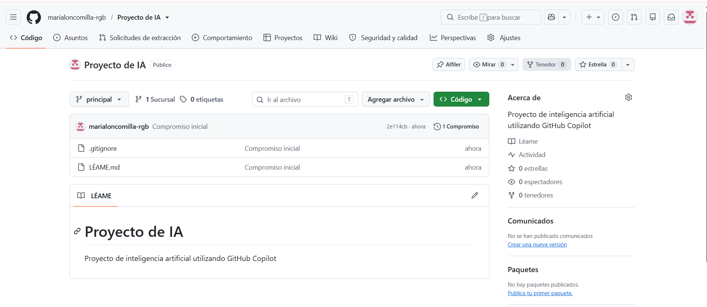
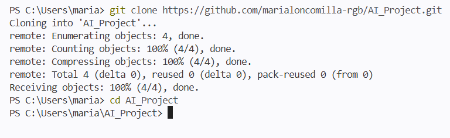
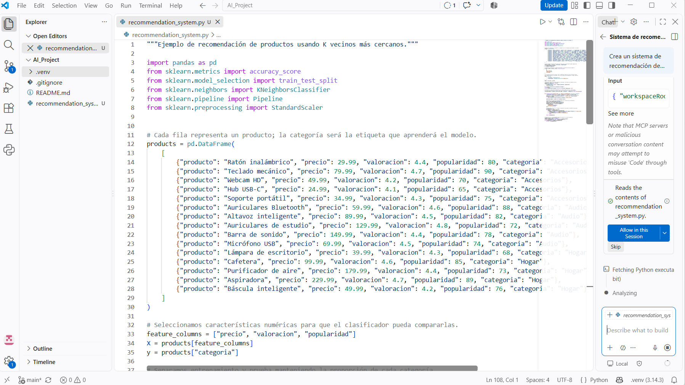
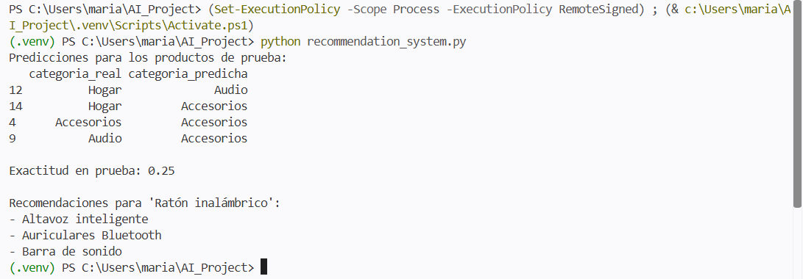

# AI_Project - Sistema de Recomendación con GitHub Copilot

## Descripción

Este proyecto fue desarrollado como una actividad práctica para explorar el uso de GitHub Copilot como herramienta de inteligencia artificial aplicada a la programación.

Se creó un sistema de recomendación de productos utilizando Python, pandas y scikit-learn. El código fue generado con apoyo de GitHub Copilot y posteriormente revisado mediante las herramientas disponibles en Visual Studio Code.

## Herramientas utilizadas

- GitHub
- GitHub Copilot
- Visual Studio Code
- Python
- Pandas
- Scikit-learn
- Git

## Proceso realizado

### 1. Creación del repositorio

Se creó un repositorio en GitHub llamado `AI_Project`, configurado como público. Además, se agregó un archivo README y un archivo `.gitignore` para Python.

### 2. Clonación del repositorio

El repositorio fue clonado de forma local utilizando Git desde la terminal de Visual Studio Code.

### 3. Creación del archivo Python

Se creó el archivo:

`recommendation_system.py`

Este archivo contiene el código principal del sistema de recomendación.

### 4. Uso de GitHub Copilot

Se utilizó GitHub Copilot desde Visual Studio Code para generar el código inicial del sistema de recomendación.

El prompt utilizado fue:

> Crea un sistema de recomendación de productos en Python utilizando pandas y scikit-learn. Debe cargar datos de productos, seleccionar características, dividir los datos en entrenamiento y prueba, entrenar un modelo KNeighborsClassifier, realizar predicciones y mostrar un ejemplo de recomendación. Agrega comentarios para explicar cada parte del código.

### 5. Funcionamiento del sistema

El programa utiliza información de diferentes productos, considerando características como:

- Precio
- Valoración
- Popularidad
- Categoría

Se utiliza el algoritmo `KNeighborsClassifier` para clasificar los productos y generar recomendaciones a partir de sus características.

### 6. Revisión del código

GitHub Copilot y las herramientas de Python de Visual Studio Code fueron utilizadas para revisar el código generado. La validación estática no detectó errores de sintaxis.

## Evidencias

En esta sección se incorporan capturas de pantalla del proceso realizado:

- Creación del repositorio en GitHub.
- Clonación del repositorio en Visual Studio Code.
- Creación de `recommendation_system.py`.
- Generación del código utilizando GitHub Copilot.
- Revisión del código generado.

## Conclusión

Esta actividad permitió utilizar GitHub Copilot como apoyo para el desarrollo de código en Python y conocer de forma práctica cómo una herramienta de inteligencia artificial puede asistir durante el proceso de programación.

## Evidencias del proceso

A continuación se presentan capturas de pantalla que evidencian el desarrollo del proyecto y el uso de GitHub Copilot.

### 1. Creación del repositorio en GitHub

Se creó el repositorio del proyecto en GitHub, configurándolo como público e incorporando un archivo README y un archivo `.gitignore` para Python.

### 2. Clonación del repositorio

El repositorio fue clonado en el equipo local utilizando Git, permitiendo trabajar con el proyecto desde Visual Studio Code.

### 3. Generación de código con GitHub Copilot

Se utilizó GitHub Copilot para apoyar la generación de un sistema de recomendación de productos en Python. El código utiliza pandas y scikit-learn para procesar los datos y realizar las recomendaciones.

### 4. Ejecución del sistema de recomendación

Finalmente, el programa fue ejecutado desde la terminal de Visual Studio Code. El sistema realizó predicciones y generó recomendaciones de productos, comprobando el funcionamiento del código desarrollado.

